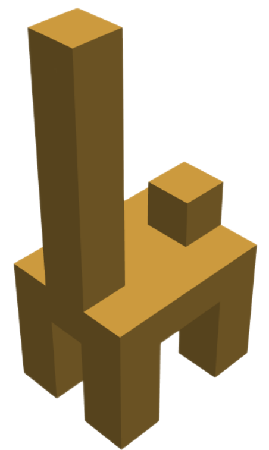

<h1 align="left">
    Blox-Net
    
</h1>

## Generative Design-for-Robot-Assembly using VLM Supervision, Physics Simulation, and A Robot with Reset

[[Project Page](https://bloxnet.org/)] [[Paper](https://arxiv.org/abs/2409.17126)]


# Setup

## Installation
- Create a conda environment with ```conda create -n bloxnet -y python=3.10```

- Activate the conda environment with ```conda activate bloxnet```

- Clone this repository with ```git clone https://github.com/Apgoldberg1/blox-net-coderelease.git```

- Install Blox-Net and required dependencies with ```pip install -e .```

- If you would like to render the generated structures using ```scripts/pretty_visualize.py```, you will also have to install PyVista with the command ```pip install pyvista```

## OpenAI API Key
To call GPT, create a ```.env``` file in the home directory of the repository and include ```OPENAI_API_KEY=[your api key]```


# Running Blox-Net

## Repository Structure
- ```scripts```: runnable files for generating and rendering structures

- ```perturbation_analysis```: the implementation of the perturbation redesign pipeline, as discussed in the paper.

- ```bloxnet```: Core code for design generation. Queries ChatGPT and simulates block placements.


## Generating Structures
To generate structures using Blox-Net's iterative physics-grounded prompting, run ```python scripts/full_pipeline.py``` after adjusting the ```structure_names``` list.

- WARNING: The max_workers parameter in ```full_pipeline.py``` and ```run_pipeline_single_obj_parallel.py``` might need to be adjusted on low memory systems

For example, to generate 15 designs of the `Bridge` structure with 10 workers, run
```
python scripts/run_pipeline_single_obj_parallel.py Bridge --num-structures 15 --num-workers 10
```

10 versions of each structure are generated; structures and all prompts are saved in ```gpt_caching/{structure_name}```, and the best assembly is selected by ChatGPT and saved in the ```best_assembly``` subdirectory. Inside each structure directory, PyBullet renders are saved and the subdirectories ```prompts```, ```responses```, and ```context``` include the VLM conversation history.

To perform perturbation redesign refer to ```scripts/perturb_objects.py```. By default, perturbation redesign will be executed on the generation in the ```best_assembly``` subdirectory of each object.

To render structures as shown in the paper using PyVista, refer to ```scripts/pretty_visualize.py```. By default, Blox-Net will take images of structures through PyBullet, but rendering with PyVista looks nicer.

# Additional Generations


# Bibtex
If you find Blox-Net useful, please cite our paper!

```
@inproceedings{goldberg2025bloxnet,
  title={Blox-Net: Generative Design-for-Robot-Assembly Using VLM Supervision, Physics Simulation, and a Robot with Reset},
  author={Andrew Goldberg and Kavish Kondap and Tianshuang Qiu and Zehan Ma and Letian Fu and Justin Kerr and Huang Huang and Kaiyuan Chen and Kuan Fang and Ken Goldberg},
  booktitle={Proceedings of the IEEE International Conference on Robotics and Automation (ICRA)},
  year={2025},
  url={https://arxiv.org/abs/2409.17126},
}
```
